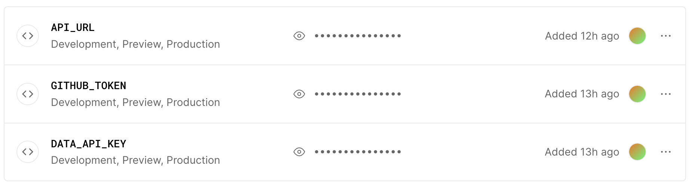

This is a [Next.js](https://nextjs.org/) project bootstrapped with [`create-next-app`](https://github.com/vercel/next.js/tree/canary/packages/create-next-app).

## Getting Started

First, run the development server:

```bash
npm run dev
# or
yarn dev
# or
pnpm dev
```

Open [http://localhost:3000](http://localhost:3000) with your browser to see the result.

You can start editing the page by modifying `app/page.tsx`. The page auto-updates as you edit the file.

This project uses [`next/font`](https://nextjs.org/docs/basic-features/font-optimization) to automatically optimize and load Inter, a custom Google Font.

## API

> `GET` /api/todos
>
> `POST` /api/todos
>
> `PUT` /api/todos
>
> `DELETE` /api/todos

```sh
curl --request GET \
     --url 'http://localhost:3000/api/todos' \
     --header 'User-Agent: Thunder Client (https://www.thunderclient.com)' \
     --header 'accept: application/json'
```

## Learn More

To learn more about Next.js, take a look at the following resources:

- [Next.js Documentation](https://nextjs.org/docs) - learn about Next.js features and API.
- [Learn Next.js](https://nextjs.org/learn) - an interactive Next.js tutorial.

You can check out [the Next.js GitHub repository](https://github.com/vercel/next.js/) - your feedback and contributions are welcome!

## Deploy on Vercel

> Notes: Please set some enviorment before deploy. [Vercel environment-variables](https://vercel.com/mrzhouzh/next-restful-api/settings/environment-variables). see the [`.env.example`](./.env.example) file



The easiest way to deploy your Next.js app is to use the [Vercel Platform](https://vercel.com/new?utm_medium=default-template&filter=next.js&utm_source=create-next-app&utm_campaign=create-next-app-readme) from the creators of Next.js.

Check out our [Next.js deployment documentation](https://nextjs.org/docs/deployment) for more details.

## 📝 Additions Info

[Thunder Client - vscode extension 轻量级测试接口扩展](https://marketplace.visualstudio.com/items?itemName=rangav.vscode-thunder-client)

[typicode - Todo Api Mock server](https://jsonplaceholder.typicode.com/)

## Issues

Some problems from development to deployment

1. `pnpm run build` cause a error:

```sh
TypeError: fetch failed
    at Object.fetch (node:internal/deps/undici/undici:11457:11)
    at process.processTicksAndRejections (node:internal/process/task_queues:95:5) {
  cause: Error: connect ECONNREFUSED ::1:3000
      at TCPConnectWrap.afterConnect [as oncomplete] (node:net:1494:16)
      at TCPConnectWrap.callbackTrampoline (node:internal/async_hooks:130:17) {
    errno: -61,
    code: 'ECONNREFUSED',
    syscall: 'connect',
    address: '::1',
    port: 3000
  }
}

Error occurred prerendering page "/todos". Read more: https://nextjs.org/docs/messages/prerender-error
```

**Resolved**:

> reference: ["Fetch failed" error in production mode](https://github.com/vercel/next.js/issues/49578)

```tsx
// src/app/todos/page.tsx
export const runtime = "edge"
```

2. After deployed `process.env.[xxx]` is `undefined`

**Resolved**:

```diff
// next.config.js
module.exports = {
+   env: {
+     DATA_API_KEY: process.env.DATA_API_KEY,
+     API_URL: process.env.API_URL,
+     GITHUB_TOKEN: process.env.GITHUB_TOKEN,
+   },
}
```

Vercel should also set some enviroment variables

[go to set! ➡️](https://vercel.com/mrzhouzh/next-restful-api/settings/environment-variables)

3. fetch api interface cause CROSS-ORIGIN error:

> reference: https://blog.logrocket.com/using-cors-next-js-handle-cross-origin-requests/

**Resolved**:

```diff
# More details see: src/middleware.ts
export function middleware(req: Request) {
  ...
+  const res = NextResponse.next()
+  if (origin && allowOrigins.includes(origin)) {
+    res.headers.appendif (origin && allowOrigins.includes(origin)) {
+    res.headers.append('Access-Control-Allow-Origin', origin);
+    // res.headers.append('Access-Control-Allow-Origin', '*') // replace this your actual origin
+  }
+  res.headers.append('Access-Control-Allow-Credentials', "true")
+  res.headers.append('Access-Control-Allow-Methods', 'GET,DELETE,PATCH,POST,PUT')
+  res.headers.append(
+    'Access-Control-Allow-Headers',
+    'X-CSRF-Token, X-Requested-With, Accept, Accept-Version, Content-Length, Content-MD5, Content-Type, Date, X-Api-Version'
+  )
+
+  return res
}
```

Redeploy.
